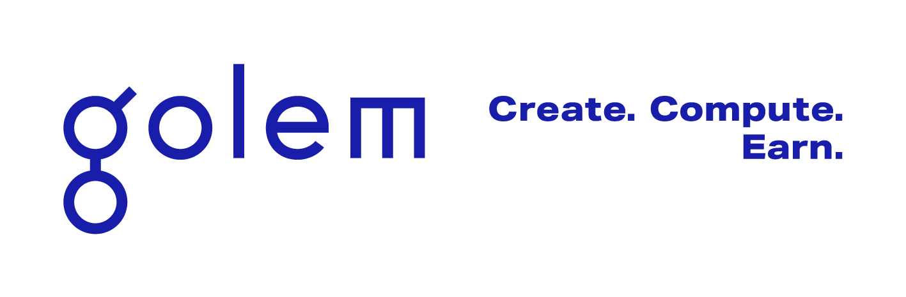
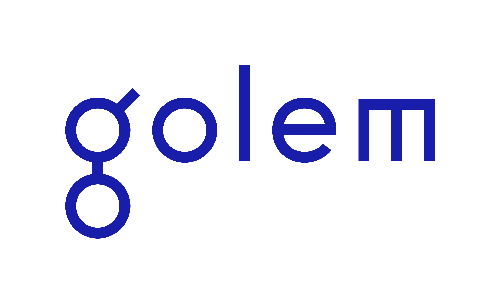

  

# Golem Community Builder Programme

**Build on decentralised compute · Construir sobre compute descentralizado · Construa sobre compute descentralizado**

 

### 💰 500 USD in $GLM per approved project
**Open programme · No deadlines · Rolling review**

 

  

 

---

## 🌐 Choose your language · Selecciona tu idioma · Selecione seu idioma

 

<table>
<tr>
<td align="center" width="33%">

### 🇬🇧 English

Full programme documentation
in English.

 

[**→ Go to the English version**](./en/README.md)

</td>
<td align="center" width="33%">

### 🇪🇸 Español

Documentación completa del programa
en español.

 

[**→ Ir a la versión en español**](./es/README.md)

</td>
<td align="center" width="33%">

### 🇧🇷 Português

Documentação completa do programa
em português.

 

[**→ Ir para a versão em português**](./pt/README.md)

</td>
</tr>
</table>

---

**Powered by $GLM · Built for Ethereum · Open to everyone**

 

[**→ Apply to the programme**](https://forms.golem.network/golem-builders-programme)

© Golem Network · Community Builder Programme

