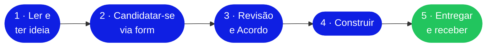

  

# Golem Community Builder Programme

**Construa sobre computação descentralizada. Receba em $GLM.**

 

### 💰 500 USD em $GLM · 2-4 semanas · Avaliação contínua

 

  

 

[**Builders Guide**](./docs/guia_builders.md) ·
[**FAQ**](./FAQ.md)

---

## Introdução

O **Golem Community Builder Programme** é uma iniciativa aberta e contínua dirigida a desenvolvedores que queiram construir projetos funcionais sobre a Golem Network.

O seu objetivo é financiar trabalho técnico genuíno que demonstre, de forma concreta, as capacidades do protocolo: projetos que vivam no GitHub, gerem conversa na comunidade e contribuam para o ecossistema de computação descentralizada.

> Cada projeto aprovado recebe um bounty de **500 USD pagos em $GLM**, com duração estimada entre duas e quatro semanas de desenvolvimento.

---

## A quem se destina

Se você consegue construir, pode se candidatar. O programa está aberto a qualquer desenvolvedor com capacidade técnica para entregar um projeto real — engenheiros de backend, profissionais de ML, desenvolvedores de sistemas distribuídos, desenvolvedores Ethereum e qualquer pessoa com experiência prática relevante.

Perfil Web2 ou Web3, veterano do Golem ou estreante — não importa. O que importa é conseguir definir escopo, construir, documentar e entregar.

> Não é necessário ter experiência prévia com Golem.

---

## O que os participantes constroem

O programa propõe cinco tracks orientados a diferentes tipos de demonstrações técnicas. Os tracks não são rígidos: funcionam como pontos de partida e referência para quem prefere um marco definido.

Quem tiver uma ideia própria pode propô-la pelo Track E, sujeita a aprovação prévia pela equipe.

<table>
<tr>
<td width="33%" valign="top">

### 🎬 Track A
**Parallel Media Processing**

Processamento paralelo de arquivos de áudio e vídeo em múltiplos providers.

[Detalhes →](./docs/guia_builders.md#track-a)

</td>
<td width="33%" valign="top">

### 🔬 Track B
**Compute-Intensive Simulation**

Simulações numéricas, Monte Carlo e computação científica em escala.

[Detalhes →](./docs/guia_builders.md#track-b)

</td>
<td width="33%" valign="top">

### 📊 Track C
**Provider Reputation & Benchmarking**

Ferramentas de medição, scoring e benchmarking de providers.

[Detalhes →](./docs/guia_builders.md#track-c)

</td>
</tr>
<tr>
<td width="33%" valign="top">

### ♟️ Track D
**Chess Engine / Game AI**

IA de jogos como demonstração acessível de paralelismo.

[Detalhes →](./docs/guia_builders.md#track-d)

</td>
<td width="33%" valign="top">

### 🚀 Track E
**Open Track**

Proposta livre do builder, validada antes do início.

[Detalhes →](./docs/guia_builders.md#track-e)

</td>
<td width="33%" valign="top">

&nbsp;

</td>
</tr>
</table>

A descrição completa de cada track, incluindo direções técnicas sugeridas, encontra-se no [**Builders Guide**](./docs/guia_builders.md).

---

## Processo de participação

### 1. Leia este README e o Builders Guide

Leia este documento e o [Builders Guide](./docs/guia_builders.md), depois escolha uma ideia. O Guide descreve os cinco tracks em detalhe e inclui direções técnicas sugeridas para ajudar a definir o escopo do projeto.

### 2. Candidate-se pelo formulário

Submeta sua ideia pelo [**formulário de candidatura**](https://forms.golem.network/golem-builders-programme). Inclua o track escolhido, uma breve descrição do projeto, sua abordagem técnica e experiência prévia relevante.

### 3. Revisão e definição de escopo

A equipe da Golem avalia as candidaturas de forma contínua. Se a sua ideia for adequada, entraremos em contacto para discutir os detalhes e alinhar escopo, marcos e entregáveis. Projetos que não se encaixem receberão uma nota curta explicando o motivo.

### 4. Desenvolva

Uma vez aprovado, você começa a construir no seu próprio repositório público no GitHub. A equipe da Golem fica disponível no Discord para tirar dúvidas técnicas e acompanhar o progresso. O prazo típico é de **duas a quatro semanas**, ajustado conforme o escopo acordado.

### 5. Entregue e receba

Submeta todos os entregáveis acordados. Após a validação pela equipe da Golem, o bounty é transferido diretamente para a sua wallet em **$GLM**. O bounty é pago em $GLM dentro de 7 dias úteis após a validação do entregável.

---

## O que a Golem oferece e o que se espera do builder

O programa funciona como uma colaboração estruturada com compromissos claros de ambas as partes.

<table>
<tr>
<th width="50%">🟦 O que a Golem Network oferece</th>
<th width="50%">🟨 O que se espera do builder</th>
</tr>
<tr>
<td valign="top">

- Acesso direto à equipe técnica para consultas, revisões e debugging
- Co-promoção do projeto finalizado pelos canais oficiais e comunidades parceiras

</td>
<td valign="top">

- Compromisso real com a entrega do projeto no escopo acordado
- Código publicado no GitHub sob licença aberta com documentação clara
- Um write-up final que permita a outros desenvolvedores entender e reproduzir o trabalho
- Um vídeo demo curto (2–3 minutos) mostrando o projeto em funcionamento, para divulgação nos canais da Golem

</td>
</tr>
</table>

---

## Recursos do repositório

| Documento                                                                     | Propósito                                                        |
| ----------------------------------------------------------------------------- | ---------------------------------------------------------------- |
| [📘 Builders Guide](./docs/guia_builders.md)                                 | Descrição completa dos cinco tracks, exemplos e entregáveis      |
| [📨 Candidatar-se](https://forms.golem.network/golem-builders-programme)      | Submeta sua ideia pelo formulário de candidatura                 |
| [❓ FAQ](./FAQ.md)                                                             | Perguntas frequentes sobre o programa                            |

> 🇬🇧 **English version:** [`/en/README.md`](../en/README.md) · 🇪🇸 **Versión en español:** [`/es/README.md`](../es/README.md)

---

## Projetos anteriores

À medida que projetos forem concluídos, esta seção cresce. Abaixo estão as primeiras entradas.

| | |
|---|---|
| **[gScribe](https://gscribe.ai/)** · Track A — Parallel Media Processing Transcrição paralela de áudio com Whisper distribuído entre múltiplos providers da Golem. Uma referência concreta do que o programa produz. | |

---

## Sobre a Golem Network

A Golem Network é um marketplace descentralizado de recursos computacionais. Os desenvolvedores podem alugar capacidade de processamento proveniente de máquinas reais distribuídas pela rede, pagar pelo uso em $GLM e executar tarefas paralelizáveis numa escala impraticável numa única máquina: transcodificação de vídeo, inferência de modelos de machine learning, simulações científicas, processamento massivo de dados, entre outros casos de uso.

#### Recursos oficiais

| Recurso | Link |
|---------|------|
| Documentação técnica | [docs.golem.network](https://docs.golem.network) |
| Repositórios oficiais | [github.com/golemfactory](https://github.com/golemfactory) |
| Token $GLM | [golem.network/glm](https://golem.network/glm) |
| Comunidade Discord | [discord.gg/golem](https://discord.gg/golem) |

---

## Contato

Para dúvidas sobre o programa antes de submeter uma candidatura, o canal recomendado é o Discord oficial da Golem, no canal de builders:

---

**Desenvolvido com $GLM · Construído para Ethereum · Aberto a todos**

 

[**→ Candidatar-se ao programa**](https://forms.golem.network/golem-builders-programme)

© Golem Network · Community Builder Programme

